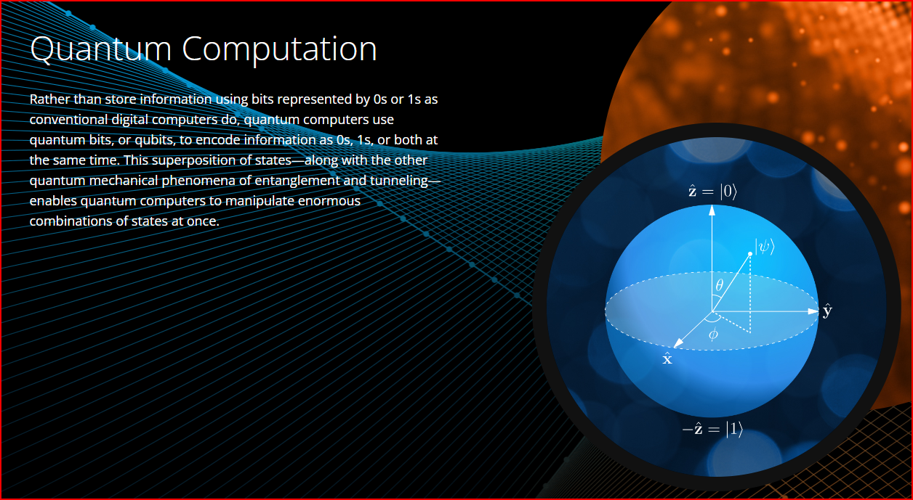

# World Quantum Day (WQD) 2024

World Quantum Day (WQD) takes place every April 14 to raise public awareness and understanding of quantum science and technology. 

- [World Quantum Day](https://worldquantumday.org/)
- [Middle School Quantum Computing Summer Camp (virtual, $495) for 6th to 8th graders](https://www.qubitbyqubit.org/middle-school-camp)

## Invited Talk - Northwest Missouri State University

Dr. Saurabh Maiti will be the quantum scientist visiting your class! 
The visit will be geared towards Quantum Computing in the Real World. 
The virtual visit takes place April 14 2024 as part of the celebration of World Quantum Day. 

- Dr. Saurabh Maiti
- Assistant Professor
- Department of Physics
- Concordia University
- Web: <http://www.concordia.ca/faculty/saurabh-maiti.html>

Dr. Maiti earned his PhD in Physics in 2013 from the University of Wisconsin, Madison, and 
his Bachelors in Electronics and Electrical Communications Engg from Indian Institute of Technology, India.
We was awarded the Dirac Postdoctoral Prize at the National High Magnetic Field Laboratory in Tallahassee.
He served as a postdoctoral researcher at the University of Florida in Gainesville and at the University of Massachusetts in Amherst.
His research at Concordia University in Montreal, Quebec, Canada is in theoretical condensed matter physics and quantum phenomena in 2-dimensional materials for application in quantum technology.

## Privacy and Security

Current encryption methods often use calculations that are easy to perform but very hard to reverse - such as finding the prime factors of large numbers. It is said that Quantum Computing won't break passwords - it'll break encryption by making these "hard to reverse'' tasks easy. How might this affect us in terms of passwords, privacy, and security? Are new cryptographic techniques being developed in anticipation of quantum computing?

## Qubit Problems

Traditional computing represents information as a bit - either 0 or 1. Quantum computing uses a qubit - it's like each one holds a vector that points to a place on a sphere of radius one. Every place on the surface of the sphere is a possible value, so each qubit can hold many possible "superpositions" of 0 and 1 - in addition to the traditional 0 (the north pole) and 1 (the south pole). What kind of problems will this be useful for? 

## Entanglement

Is it true that qubits can be entangled so the state of one qubit affects the state of another qubit immediately - even over vast distances? How is that property useful for solving problems? 

## Machine Learning / AI

As data analysts, we use a variety of methods to get our machines to make sense of massive amounts of data. How will quantum computing enhance machine learning (ML)? Are there areas of ML - and artificial intelligence - that might especially benefit from quantum computing?

## Work / Home Devices

Will there be a home Quantum Personal Computer?  What's a likely timeline for quantum computing becoming an everyday tool?

## Moore's Law

Since 1965, Moore's Law suggests processing power doubles approximately every 18-24 months. Do you think this trend will hold - or accelerate - or will we see a "quantum leap" in general processing power?

## Complex Problems

Will quantum computing be able to help solve complex problems such as climate change and human health?

## Students & Professionals

What should students or professionals interested in the new possibilities be learning? What skills and knowledge will be most valuable? (For those who want to use the new technologies - not build them.)

## Resources

See:

- IBM Qiskit at <https://www.ibm.com/quantum/qiskit>
- Google QuantumAI at <https://quantumai.google/>
- Azure Quantum at <https://quantum.microsoft.com/>
- Intel [Quantum Computing](https://www.intel.com/content/www/us/en/research/quantum-computing.html) and [Software Development Kit (SDK)](https://www.intel.com/content/www/us/en/developer/tools/quantum-sdk/overview.html)
- [Amazon Quantum Computing](https://aws.amazon.com/what-is/quantum-computing/) and [Bracket](https://aws.amazon.com/braket/)
- D-Wave at <https://www.dwavesys.com/>
- Cirq - a Python library for working with Qubits at <https://github.com/quantumlib/Cirq>

## Illustration

From D-Wave at <https://www.dwavesys.com/learn/quantum-computing/>:

## Participate

- Add questions to [this document](https://github.com/denisecase/world-quantum-day-2024) or the associated [discussions](https://github.com/denisecase/world-quantum-day-2024/discussions). 
